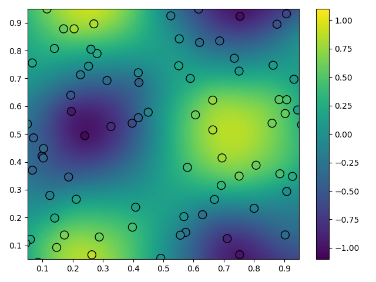
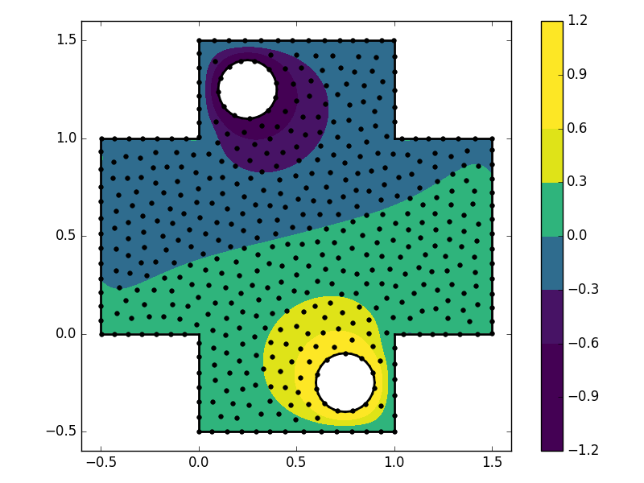
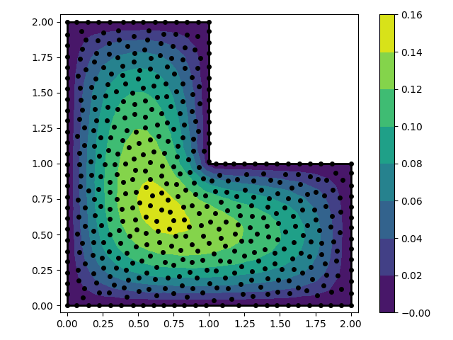

RBF
+++
Python package containing tools for radial basis function (RBF) applications.
Applications include interpolating scattered data and solving partial
differential equations (PDEs) over irregular domains. Much of this package was
inspired by the books "A Primer on Radial Basis Functions with Applications to
the Geosciences" by Bengt Fornberg and Natasha Flyer and "Meshfree
Approximation Methods with Matlab" by Gregory Fasshauer. The complete
documentation for this package can be found 
`here <http://rbf.readthedocs.io>`_.

Features
========
* The ``RBF`` class, which is used to evaluate RBFs and their exact derivatives
* The ``RBFInterpolant`` class, which is used to interpolate scattered and
  potentially noisy N-dimensional data. One can also evaluate the exact
  derivatives of the interpolant
* The ``weight_matrix`` function, which generates radial basis function finite
  difference (RBF-FD) weights. This is used for solving large scale PDEs over
  irregular domains
* Node generation functions, such as ``min_energy_nodes`` and
  ``poisson_disc_nodes``, which are used for solving PDEs with the spectral RBF
  method or the RBF-FD method
* Computational geometry functions (e.g. point in polygon testing) for two and
  three spatial dimensions
* The ``GaussianProcess`` class, which is used for Gaussian process regression
  (GPR). GPR is similar to RBF interpolation, except it has a Bayesian
  statistical foundation

Installation
============
Using conda
-----------
If you are using a linux computer and you have conda. you can install ``RBF``
and its dependencies with the command

.. code-block:: bash

  $ conda install rbf -c treverhines -c conda-forge

From source
-----------
``RBF`` requires the following packages: ``numpy``, ``scipy``, ``sympy``,
``cython``, and ``rtree``. These dependencies should all be installable with
conda or pip.

Download the ``RBF`` package

.. code-block:: bash

  $ git clone http://github.com/treverhines/RBF.git

Compile and install

.. code-block:: bash

  $ cd RBF
  $ python setup.py install

Test that everything works

.. code-block:: bash

  $ cd test
  $ python -m unittest discover

Demonstration
=============
Smoothing Scattered Data
------------------------
.. code-block:: python

  '''                                                                    
  In this example we generate synthetic scattered data with added
  noise and then fit it with a smoothed RBF interpolant. The
  interpolant in this example is equivalent to a thin plate spline.
  '''                                                                    
  import numpy as np                                                     
  from rbf.interpolate import RBFInterpolant                             
  import matplotlib.pyplot as plt                                        
  np.random.seed(1)                                                      
                                                                           
  # observation points                                                   
  x_obs = np.random.random((100, 2))                                     
  # values at the observation points                                     
  u_obs = np.sin(2*np.pi*x_obs[:, 0])*np.cos(2*np.pi*x_obs[:, 1])        
  u_obs += np.random.normal(0.0, 0.1, 100)                               
  # create a thin-plate spline interpolant, where the data is assumed
  # to be noisy
  I = RBFInterpolant(x_obs, u_obs, sigma=0.1, phi='phs2', order=1)       
  # create the interpolation points, and evaluate the interpolant        
  x1, x2 = np.linspace(0, 1, 200), np.linspace(0, 1, 200)                
  x_itp = np.reshape(np.meshgrid(x1, x2), (2, 200*200)).T                
  u_itp = I(x_itp)                                                       
  # plot the results                                                     
  plt.tripcolor(x_itp[:, 0], x_itp[:, 1], u_itp, vmin=-1.1, vmax=1.1, cmap='viridis')
  plt.scatter(x_obs[:, 0], x_obs[:, 1], s=100, c=u_obs, vmin=-1.1, vmax=1.1,
              cmap='viridis', edgecolor='k')                             
  plt.xlim((0.05, 0.95))                                                 
  plt.ylim((0.05, 0.95))                                                 
  plt.colorbar()                                                         
  plt.tight_layout()                                                     
  plt.show() 

  Plot generated by the above code. Observations are shown as scatter points
  and the smoothed interpolant is the color field.

Solving PDEs
------------
There are two methods for solving PDEs with RBFs: the spectral method and the
RBF-FD method. The spectral method has been touted as having remarkable
accuracy; however it is only applicable for small scale problems and requires a
good choice for a shape parameter. The RBF-FD method is appealing because it
can be used for large scale problems, there is no need to tune a shape
parameter (assuming you use polyharmonic splines to generate the weights), and
higher order accuracy can be attained by simply increasing the stencil size or
increasing the order of the polynomial used to generate the weights. In short,
the RBF-FD method should always be preferred over the spectral RBF method. An
example of the two methods is provided below.

.. code-block:: python

    ''' 
    In this example we solve the Poisson equation over an L-shaped domain with
    fixed boundary conditions. We use the multiquadratic RBF (`mq`)
    '''
    import numpy as np
    from rbf.basis import mq
    from rbf.pde.geometry import contains
    from rbf.pde.nodes import poisson_disc_nodes
    import matplotlib.pyplot as plt

    # Define the problem domain with line segments.
    vert = np.array([[0.0, 0.0], [2.0, 0.0], [2.0, 1.0],
                     [1.0, 1.0], [1.0, 2.0], [0.0, 2.0]])
    smp = np.array([[0, 1], [1, 2], [2, 3], [3, 4], [4, 5], [5, 0]])

    spacing = 0.07 # approximate spacing between nodes

    eps = 0.3/spacing  # shape parameter

    # generate the nodes. `nodes` is a (N, 2) float array, `groups` is a dict
    # identifying which group each node is in
    nodes, groups, _ = poisson_disc_nodes(spacing, (vert, smp)) 
    N = nodes.shape[0]

    # create "left hand side" matrix
    A = np.empty((N, N))
    A[groups['interior']] = mq(nodes[groups['interior']], nodes, eps=eps, diff=[2, 0])
    A[groups['interior']] += mq(nodes[groups['interior']], nodes, eps=eps, diff=[0, 2])
    A[groups['boundary:all']] = mq(nodes[groups['boundary:all']], nodes, eps=eps)

    # create "right hand side" vector
    d = np.empty(N)
    d[groups['interior']] = -1.0 # forcing term
    d[groups['boundary:all']] = 0.0 # boundary condition

    # Solve for the RBF coefficients
    coeff = np.linalg.solve(A, d) 

    # interpolate the solution on a grid
    xg, yg = np.meshgrid(np.linspace(0.0, 2.02, 100),
                         np.linspace(0.0, 2.02, 100))
    points = np.array([xg.flatten(), yg.flatten()]).T                    
    u = mq(points, nodes, eps=eps).dot(coeff)
    # mask points outside of the domain
    u[~contains(points, vert, smp)] = np.nan 
    # fold the solution into a grid
    ug = u.reshape((100, 100))
    # make a contour plot of the solution
    fig, ax = plt.subplots()
    p = ax.contourf(xg, yg, ug, np.linspace(0.0, 0.16, 9), cmap='viridis')
    ax.plot(nodes[:, 0], nodes[:, 1], 'ko', markersize=4)
    for s in smp:
      ax.plot(vert[s, 0], vert[s, 1], 'k-', lw=2)

    ax.set_aspect('equal')
    ax.set_xlim(-0.05, 2.05)
    ax.set_ylim(-0.05, 2.05)
    fig.colorbar(p, ax=ax)
    fig.tight_layout()
    plt.show()

.. code-block:: python

    ''' 
    In this example we solve the Poisson equation over an L-shaped domain with
    fixed boundary conditions. We use the RBF-FD method. The RBF-FD method is
    preferable over the spectral RBF method because it is scalable and does not
    require the user to specify a shape parameter (assuming that we use odd order
    polyharmonic splines to generate the weights).
    '''
    import numpy as np
    from scipy.sparse import coo_matrix
    from scipy.sparse.linalg import spsolve
    import matplotlib.pyplot as plt

    from rbf.sputils import expand_rows
    from rbf.pde.fd import weight_matrix
    from rbf.pde.geometry import contains
    from rbf.pde.nodes import poisson_disc_nodes

    # Define the problem domain with line segments.
    vert = np.array([[0.0, 0.0], [2.0, 0.0], [2.0, 1.0],
                     [1.0, 1.0], [1.0, 2.0], [0.0, 2.0]])
    smp = np.array([[0, 1], [1, 2], [2, 3], [3, 4], [4, 5], [5, 0]])

    spacing = 0.07 # approximate spacing between nodes

    n = 25 # stencil size. Increase this will generally improve accuracy

    phi = 'phs3' # radial basis function used to compute the weights. Odd
                 # order polyharmonic splines (e.g., phs3) have always performed
                 # well for me and they do not require the user to tune a shape
                 # parameter. Use higher order polyharmonic splines for higher
                 # order PDEs.

    order = 2 # Order of the added polynomials. This should be at least as
              # large as the order of the PDE being solved (2 in this case). Larger
              # values may improve accuracy

    # generate nodes
    nodes, groups, _ = poisson_disc_nodes(spacing, (vert, smp)) 
    N = nodes.shape[0]

    # create the components for the "left hand side" matrix. 
    A_interior = weight_matrix(
        x=nodes[groups['interior']], 
        p=nodes, 
        n=n,
        diffs=[[2, 0], [0, 2]],
        phi=phi, 
        order=order)
    A_boundary = weight_matrix(
        x=nodes[groups['boundary:all']], 
        p=nodes, 
        n=1,
        diffs=[0, 0]) 
    # Expand and add the components together
    A  = expand_rows(A_interior, groups['interior'], N)
    A += expand_rows(A_boundary, groups['boundary:all'], N)
                               
    # create "right hand side" vector
    d = np.zeros((N,))
    d[groups['interior']] = -1.0
    d[groups['boundary:all']] = 0.0

    # find the solution at the nodes
    u_soln = spsolve(A, d) 

    # Create a grid for interpolating the solution
    xg, yg = np.meshgrid(np.linspace(0.0, 2.02, 100), np.linspace(0.0, 2.02, 100))
    points = np.array([xg.flatten(), yg.flatten()]).T                    

    # We can use any method of scattered interpolation (e.g.,
    # scipy.interpolate.LinearNDInterpolator). Here we repurpose the RBF-FD method
    # to do the interpolation with a high order of accuracy
    I = weight_matrix(
        x=points, 
        p=nodes, 
        n=n, 
        diffs=[0, 0],
        phi=phi,
        order=order)
    u_itp = I.dot(u_soln)

    # mask points outside of the domain
    u_itp[~contains(points, vert, smp)] = np.nan 
    ug = u_itp.reshape((100, 100)) # fold back into a grid

    # make a contour plot of the solution
    fig, ax = plt.subplots()
    p = ax.contourf(xg, yg, ug, np.linspace(-1e-6, 0.16, 9), cmap='viridis')
    ax.plot(nodes[:, 0], nodes[:, 1], 'ko', markersize=4)
    for s in smp:
      ax.plot(vert[s, 0], vert[s, 1], 'k-', lw=2)

    ax.set_aspect('equal')
    ax.set_xlim(-0.05, 2.05)
    ax.set_ylim(-0.05, 2.05)
    fig.colorbar(p, ax=ax)
    fig.tight_layout()
    plt.show()

