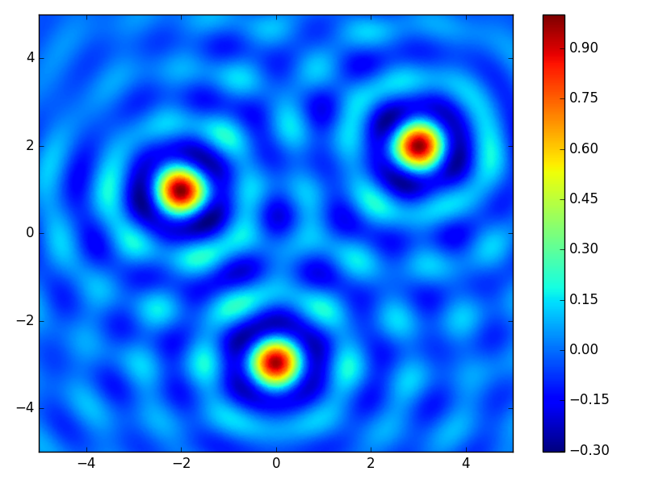

basis 
=====
.. automodule:: rbf.basis
  :members: RBF, SparseRBF, get_rbf, set_symbolic_to_numeric_method
  :special-members: __call__
  
Examples
--------
.. literalinclude:: ../scripts/basis.a.py
.. image:: ../figures/basis.a.png

.. literalinclude:: ../scripts/basis.b.py

