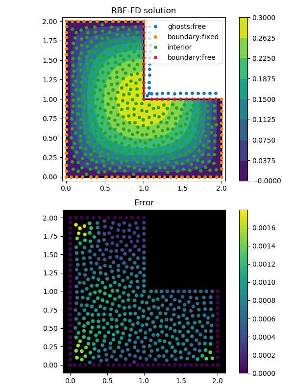

FD (Radial Basis Function Finite Differences)
=============================================
.. automodule:: rbf.fd
  :members: weights, weight_matrix, add_rows

Examples
--------
.. literalinclude:: ../scripts/fd.i.py
.. image:: ../figures/fd.i.png

.. literalinclude:: ../scripts/fd.j.py

.. literalinclude:: ../scripts/fd.b.py
.. image:: ../figures/fd.b.png

