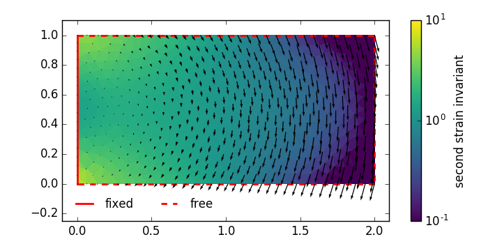
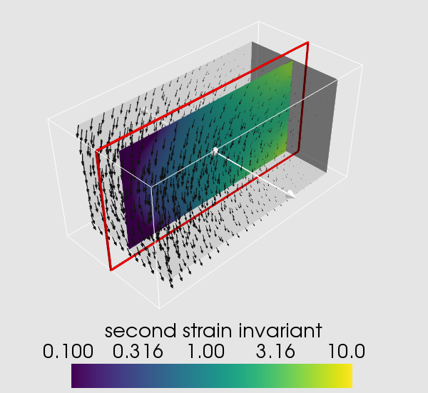
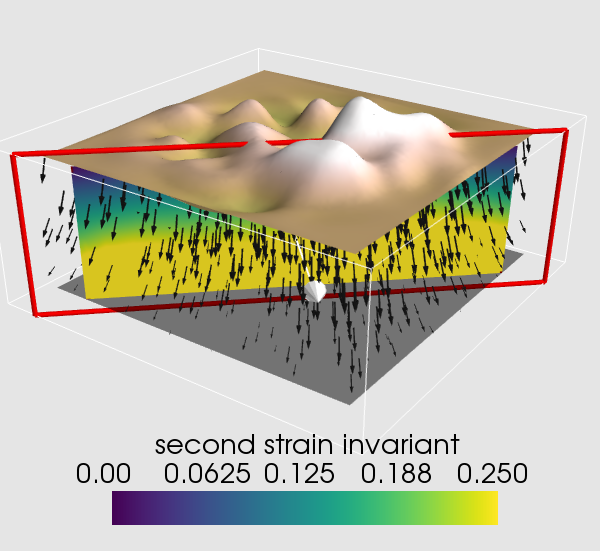

FD (Radial Basis Function Finite Differences)
=============================================
.. automodule:: rbf.fd
  :members: weights, weight_matrix

Examples
--------
.. literalinclude:: ../scripts/fd.i.py
.. image:: ../figures/fd.i.png

.. literalinclude:: ../scripts/fd.a.py
.. image:: ../figures/fd.a.png

.. literalinclude:: ../scripts/fd.b.py

This module can also be used to solve three-dimensional static 
elasticity problems.  For examples, see ``docs/scripts/fd.c.py`` and 
``docs/scripts/fd.d.py``.  The former script solves for displacements 
in a three-dimensional cantilever, and the latter script solves for 
displacements with a user-specified topography. The scripts will 
produce the following figures

``docs/scripts/fd.c.py``:

``docs/scripts/fd.d.py``:

