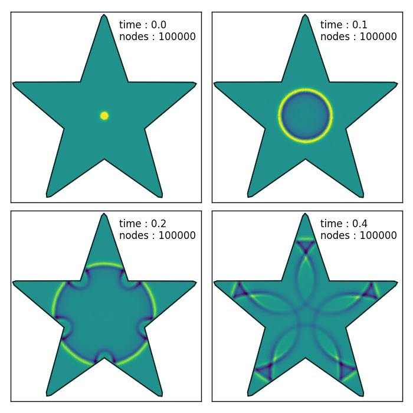

FD (Radial Basis Function Finite Difference)
============================================
.. automodule:: rbf.fd
  :members: weights, weight_matrix

Examples
--------
.. literalinclude:: ../scripts/fd.a.py

