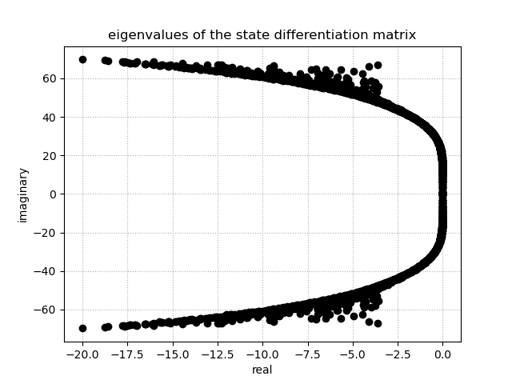

fd (Radial Basis Function Finite Differences)
=============================================
.. automodule:: rbf.pde.fd
  :members: weights, weight_matrix

Examples
--------
.. literalinclude:: ../scripts/fd.i.py
.. image:: ../figures/fd.i.png

.. literalinclude:: ../scripts/fd.j.py
.. image:: ../figures/fd.j.png

.. literalinclude:: ../scripts/fd.b.py
.. image:: ../figures/fd.b.png

.. literalinclude:: ../scripts/fd.d.py

.. image:: ../figures/fd.d.2.gif

