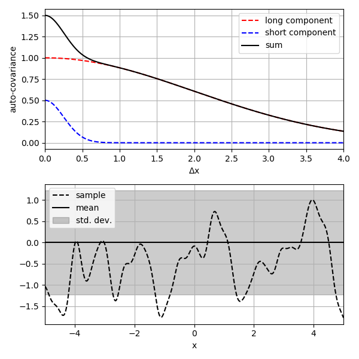
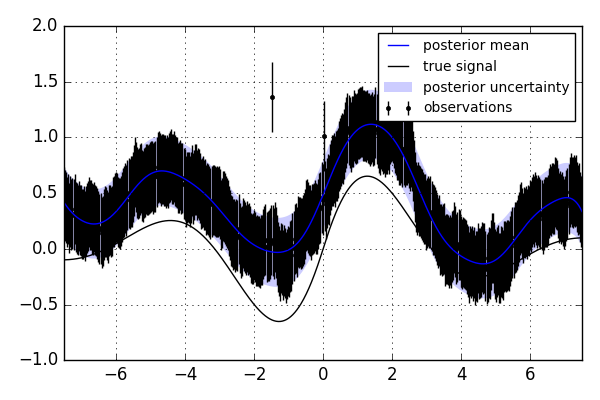
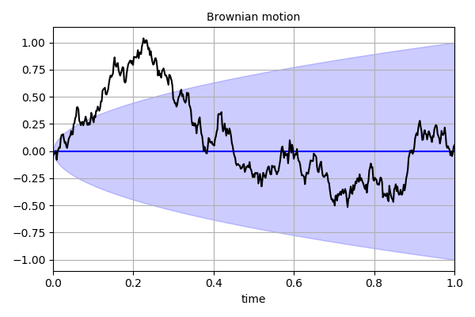
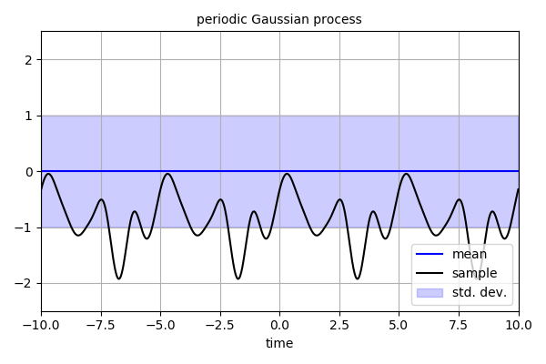

Gauss (Gaussian Process)
========================
.. automodule:: rbf.gauss
  :members:
  :special-members: __call__, __add__, __sub__, __mul__
  :show-inheritance:

Examples
--------
.. literalinclude:: ../scripts/gauss.a.py
.. image:: ../figures/gauss.a.png

.. literalinclude:: ../scripts/gauss.b.py

.. literalinclude:: ../scripts/gauss.c.py

.. literalinclude:: ../scripts/gauss.d.py

.. literalinclude:: ../scripts/gauss.e.py

