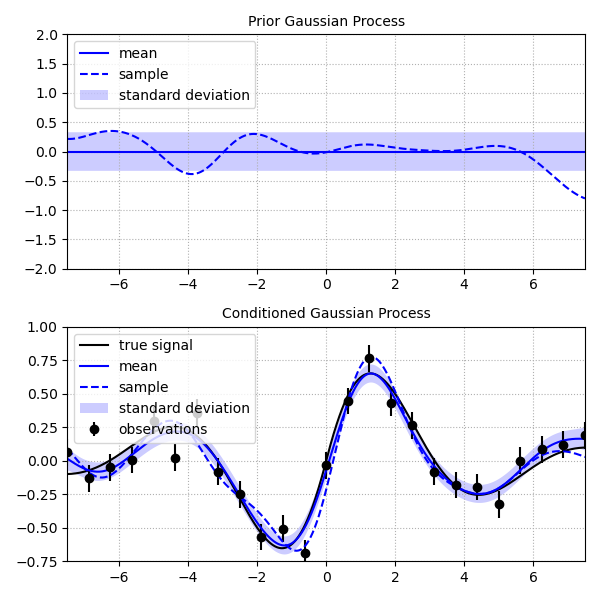
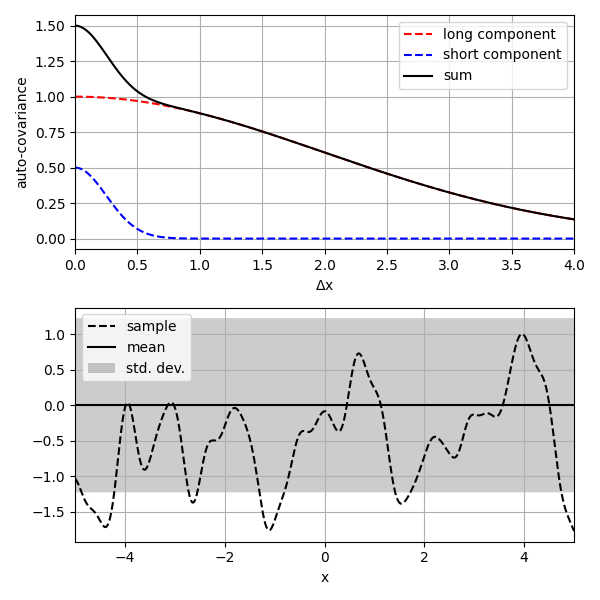
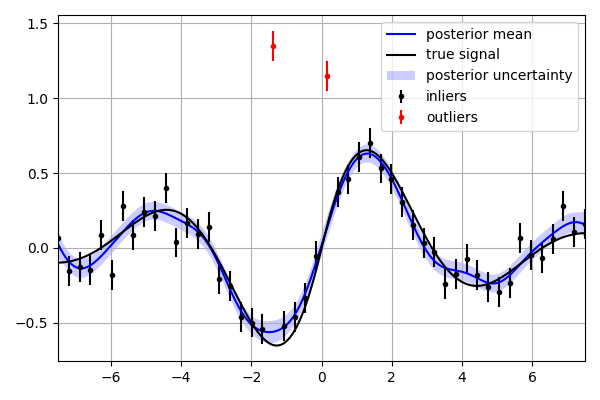
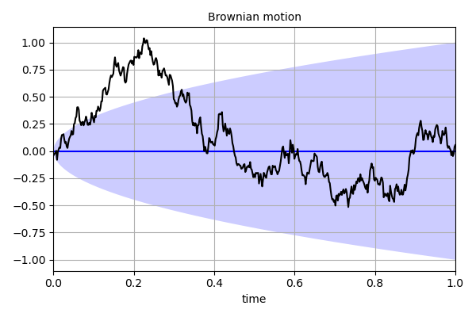
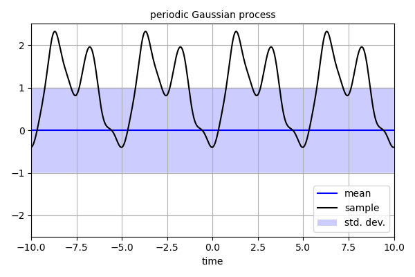
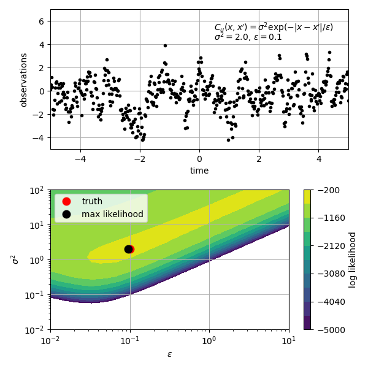
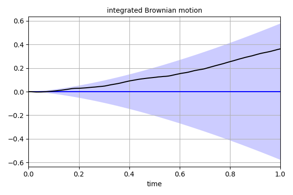

gproc (Gaussian Process)
========================
.. automodule:: rbf.gproc
  :members:
  :special-members: __call__, __add__, __sub__, __mul__
  :show-inheritance:

Examples
--------
.. literalinclude:: ../scripts/gproc.a.py

.. literalinclude:: ../scripts/gproc.b.py

.. literalinclude:: ../scripts/gproc.c.py

.. literalinclude:: ../scripts/gproc.d.py

.. literalinclude:: ../scripts/gproc.e.py

.. literalinclude:: ../scripts/gproc.f.py

.. literalinclude:: ../scripts/gproc.g.py

