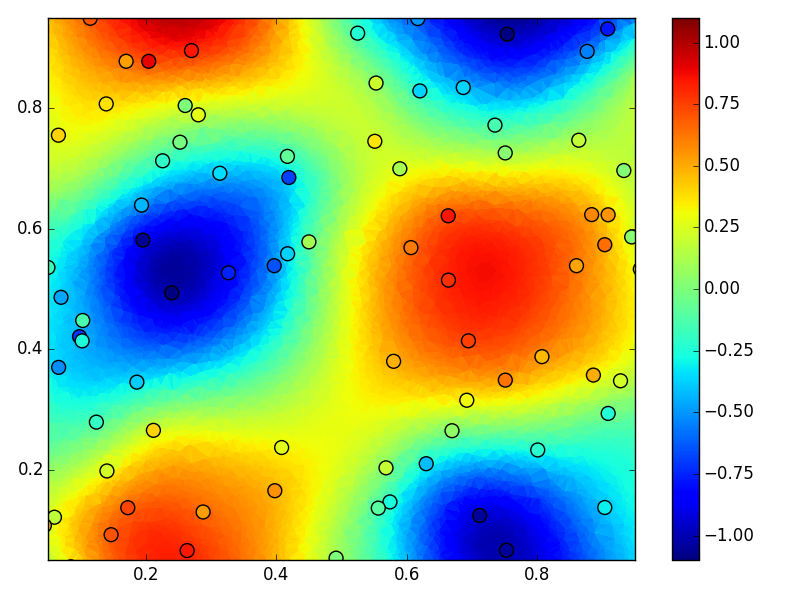
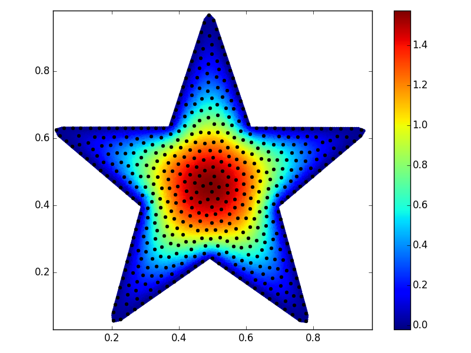

.. RBF documentation master file, created by
   sphinx-quickstart on Tue Oct 18 17:39:42 2016.
   You can adapt this file completely to your liking, but it should at least
   contain the root `toctree` directive.

RBF
***
Python package containing the tools necessary for radial basis 
function (RBF) applications.  Applications include 
interpolating/smoothing scattered data and solving PDEs over 
complicated domains.  The source code for this project can be found
`here <http://www.github.com/treverhines/RBF>`_

Features
--------
* Efficient evaluation of RBFs and their analytically derived derivatives
* Regularized RBF interpolation for noisy, scattered, data
* Generation of radial basis function finite difference (RBF-FD) 
  weights
* RBF-FD Filtering for denoising **BIG**, scattered data
* Node and stencil generation algorithms for solving PDEs over 
  complicated domains
* Computational geometry functions for 1, 2, and 3 spatial dimensions

Table of Contents
-----------------
.. toctree::
   :maxdepth: 2

   installation
   basis
   interpolate
   fd
   filter
   nodes
   stencil
   geometry

Quick Demo
----------
Smoothing Scattered Data
++++++++++++++++++++++++
Generating synthetic scattered data with added noise and then fitting 
it with a smoothed interpolant. See :doc:`filter` for smoothing large 
data sets.
  
.. code-block:: python

  import numpy as np
  from rbf.interpolate import RBFInterpolant
  import matplotlib.pyplot as plt
  np.random.seed(1)

  # create noisy data
  x_obs = np.random.random((100,2)) # observation points   
  u_obs = np.sin(2*np.pi*x_obs[:,0])*np.cos(2*np.pi*x_obs[:,1])
  u_obs += np.random.normal(0.0,0.1,100)

  # create smoothed interpolant
  I = RBFInterpolant(x_obs,u_obs,penalty=0.001)

  # create interpolation points
  x_itp = np.random.random((10000,2))
  u_itp = I(x_itp)

  plt.tripcolor(x_itp[:,0],x_itp[:,1],u_itp)
  plt.scatter(x_obs[:,0],x_obs[:,1],s=100,c=u_obs)
  plt.xlim((0.05,0.95))
  plt.ylim((0.05,0.95))
  plt.colorbar()
  plt.show()

The above code will produce this plot, which shows the observations as 
scatter points and the smoothed interpolant as the color field

Solving PDEs
++++++++++++
Solving the Poisson equation over a circle with the spectral RBF 
method.

.. code-block:: python

  import numpy as np
  from rbf.basis import phs3
  from rbf.domain import circle
  from rbf.nodes import menodes
  import matplotlib.pyplot as plt

  def forcing(x,y):
    # an arbitrary forcing function
    return -1 + np.sqrt(x**2 + y**2)

  vert,smp = circle() # use predefined domain geometry
  N = 100 # total number of nodes
  nodes,smpid = menodes(N,vert,smp) # generate nodes
  boundary, = (smpid>=0).nonzero() # identify boundary nodes
  interior, = (smpid==-1).nonzero() # identify interior nodes

  # create left-hand-side matrix and right-hand-side vector
  A = np.empty((N,N))
  A[interior]  = phs3(nodes[interior],nodes,diff=[2,0])
  A[interior] += phs3(nodes[interior],nodes,diff=[0,2])
  A[boundary,:] = phs3(nodes[boundary],nodes)
  d = np.empty(N)
  d[interior] = forcing(nodes[interior,0],nodes[interior,1])
  d[boundary] = 0.0                                           
  
  # solve the PDE
  coeff = np.linalg.solve(A,d) # solve for the RBF coefficients
  itp = menodes(2000,vert,smp)[0] # evaluate the solution at these points
  soln = phs3(itp,nodes).dot(coeff)                     

  # solution at the interpolation points
  plt.tripcolor(itp[:,0],itp[:,1],soln)
  plt.plot(nodes[:,0],nodes[:,1],'ko')
  plt.colorbar()
  plt.show()

The above code will produce this plot, which shows the collocation 
nodes as black points and the interpolated solution as the color field

Indices and tables
------------------
* :ref:`genindex`
* :ref:`modindex`
* :ref:`search`
