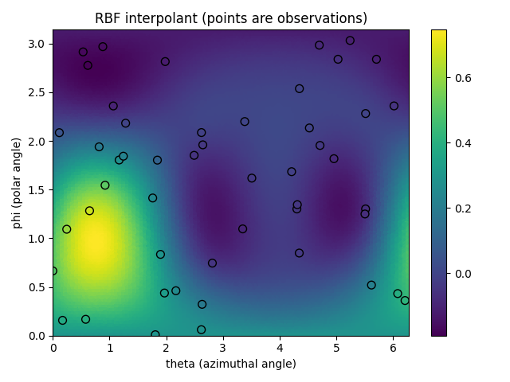
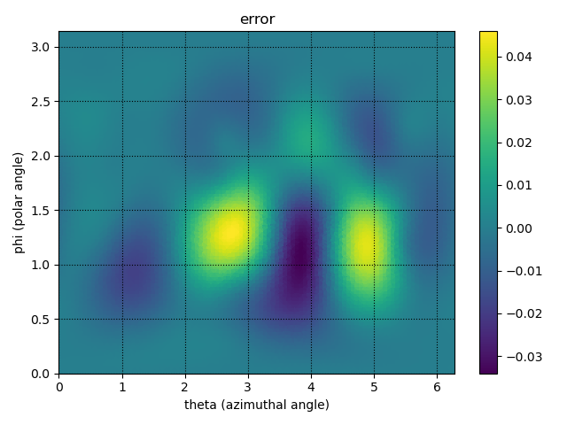

interpolate
===========
.. automodule:: rbf.interpolate
  :members:
  :special-members: __call__

Examples
--------
.. literalinclude:: ../scripts/interpolate.a.py
.. image:: ../figures/interpolate.a.png

.. literalinclude:: ../scripts/interpolate.b.py

